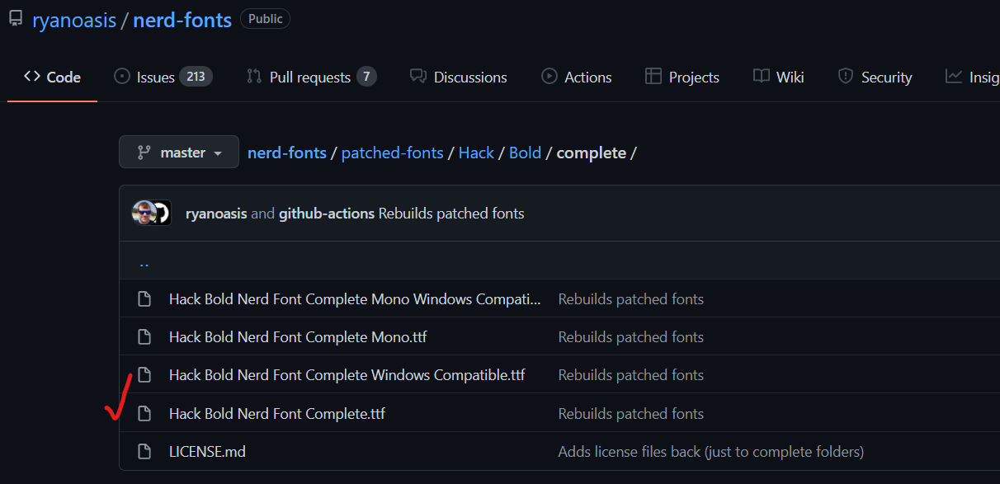
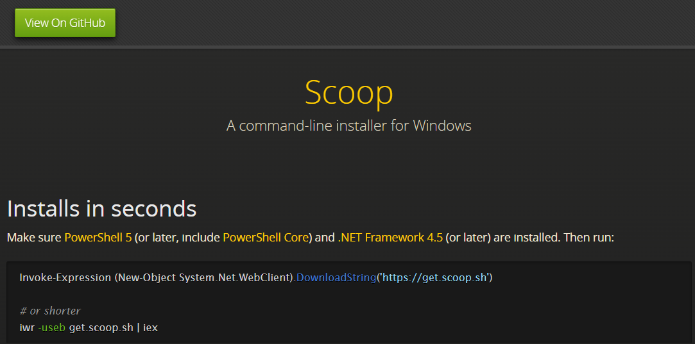

# My custom terminal 

### Ở bài viết này mình sẽ hướng dẫn các bạn xem cách mình custom terminal của mình 

### Mình custom terminal của mình theo video của một anh người Nhật tên là  [Takuya Matsuyama](https://www.craftz.dog), một Fullstack developer người Nhật

## Đây là video của anh người nhật mình đã làm theo và custom terminal của mình theo, hệ điều hành hiện tại mình đang sử dụng là hệ điều hành [Windows 11](https://www.microsoft.com/vi-vn/windows/windows-11?r=1)

[](https://www.youtube.com/watch?v=5-aK2_WwrmM)

### Các bạn có thể làm theo hướng dẫn của anh ấy, nếu các bạn gặp khó khăn trong việc custom terminal thì mình sẽ chỉ cho các bạn ở bài viết dưới đây nhé

## 1. Tải Font có tên là Hack Nerd Font

- Truy cập vào [link](https://github.com/ryanoasis/nerd-fonts/tree/master/patched-fonts/Hack/Bold/complete) này để đến trang Github của [Ryan Oasis](https://github.com/ryanoasis) và tải file .ttf có tên là Hack Bold Nerd Font Complete.ttf



- Sau đó bạn mở file font ra, ấn vào nút install

- Bạn có thể xem video hướng dẫn tại [link](https://www.youtube.com/watch?v=5-aK2_WwrmM&t=84s)

## 2. Thiết lập window terminal và cài đặt powershell

- Đầu tiên, bạn lên Microsoft store và tải app powershell về


- Tiếp theo, bạn vào Window Terminal và cài đặt 


- Chọn Powershell là startup và nhấn save


## 2.1. Chỉnh font cho window terminal

- Vào setting, chọn vào default, chọn tab appearance, chọn font là Hack Nerd Font đã cài trước đó và bấm save


## 2.2. Modded Text (không cần làm cũng được)

- Bạn có thể tham khảo tại [link](https://youtu.be/5-aK2_WwrmM?t=160)

## 2.3. Transparent Background (không cần làm cũng được)

- Bạn có thể tham khảo tại [link](https://youtu.be/5-aK2_WwrmM?t=175)

## 3. Cài đặt [Scoop.sh](https://scoop.sh)



- Vào window terminal và gõ lệnh sau

``` powershell
useb get.scoop.sh | iex
```

## 3.1. Cài đặt Curl và JQuery

- Vào window terminal và gõ lệnh sau
``` powershell
scoop install curl sudo jq
```

### Note: Hoàn thành bước 3 mới có thể sang bước 4

## 4. Cài đặt [Git](https://git-scm.com/downloads)


- Cài đặt git cho các hệ điều hành ở [link](https://git-scm.com/downloads)

- Hoặc có thể cài bằng dòng lênh cmd này
``` powershell
winget install -e -id Git.Git
```

